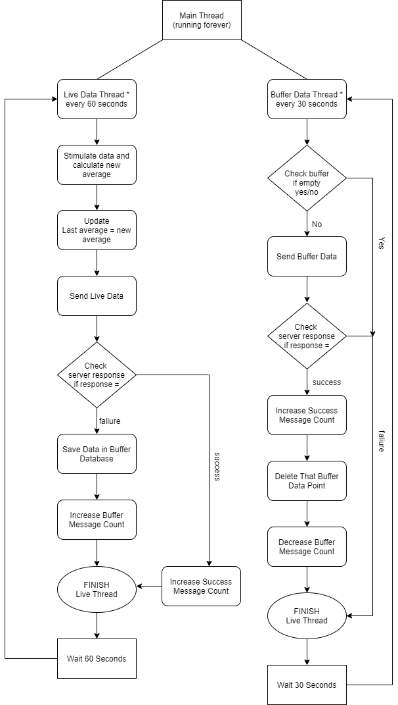

Working Flow Architecture of This Program is:

The Project Contains two main program, 
  1. [client.py](https://github.com/Jharavi007/PythonProjects/blob/main/client-server/client.py) as Edge Program.
  2. (https://github.com/Jharavi007/PythonProjects/blob/main/client-server/server.py) as HTTP Server Program.
  
 It also contains (./message_count.py) program, which returns the count of successful and buffered messages at any point of time.
 
 Running of this whole program can be done by one command:
  __sudo sh (https://github.com/Jharavi007/PythonProjects/blob/main/client-server/run.sh)__
  1. It installs all the dependencies mentioned in the (https://github.com/Jharavi007/PythonProjects/blob/main/client-server/requirements.txt) file.
  2. Then it installs & runs the open source dependency i.e. Redis DB needed for the project by launching the (https://github.com/Jharavi007/PythonProjects/blob/main/client-server/redis_installation.sh) file.
  3. Finally, It runs the (https://github.com/Jharavi007/PythonProjects/blob/main/client-server/server.py) and (https://github.com/Jharavi007/PythonProjects/blob/main/client-server/client.py) programs, while server is an Flask HTTP based server running on localhost, port = 5001.
